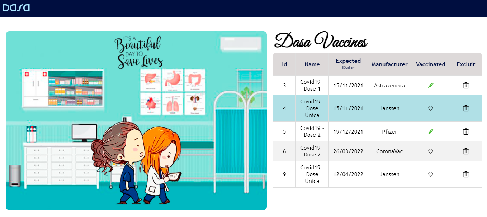

# De olho na sua vacinação!

API para controle de vacinas com o objetivo de ficar com a sua vacinação sempre em dia.

---

---

Cada vacina deverá ter as seguintes informações:

| Chave         | Descrição                            | Tipo    | Exemplo            |
| ------------- | ------------------------------------ | ------- | ------------------ |
| id            | Código da vacina                     | BigInt  | 1                  |
| name          | Nome da vacina                       | String  | "Covid19 - Dose 1" |
| expected_date | Data prevista para a vacinação       | String  | "10/10/2021"       |
| manufacturer  | Fabricante                           | String  | "Janssen"          |
| vaccinated    | Determina se o paciente foi vacinado | Boolean | true               |

---

A API é capaz de cadastrar uma nova vacina, visualizar as vacinas cadastradas e marcar se a vacinação foi realizada. Para isso:

| Verbo  | Recurso                                | Descrição                                    |
| ------ | -------------------------------------- | -------------------------------------------- |
| GET    | `/vaccines`                            | Retornar todas as vacinas cadastradas        |
| GET    | `/vaccines/:id`                        | Retornar apenas uma vacina específica        |
| GET    | `/vaccines/manufacturer/:manufacturer` | Retornar vacina com o fabricante específicao |
| POST   | `/vaccines`                            | Cadastrar uma nova vacina                    |
| PATCH  | `/vaccines/:id/vaccinated`             | Marcar se tomou a vacina                     |
| PUT    | `/vaccines/:id`                        | Atualizar dados da vacina                    |
| DELETE | `/vaccines/:id`                        | Deletar vacina                               |

---

API utilizando todos os recursos das aulas, como o NodeJS, o banco de dados e a plataforma Heroku.

https://dasa-vaccines.herokuapp.com/
